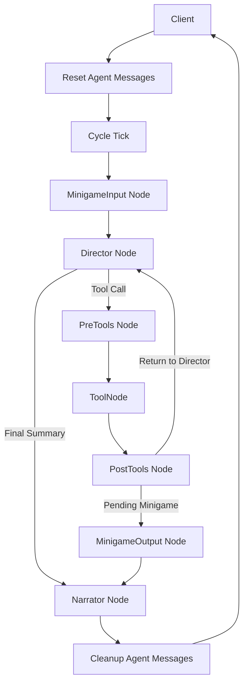
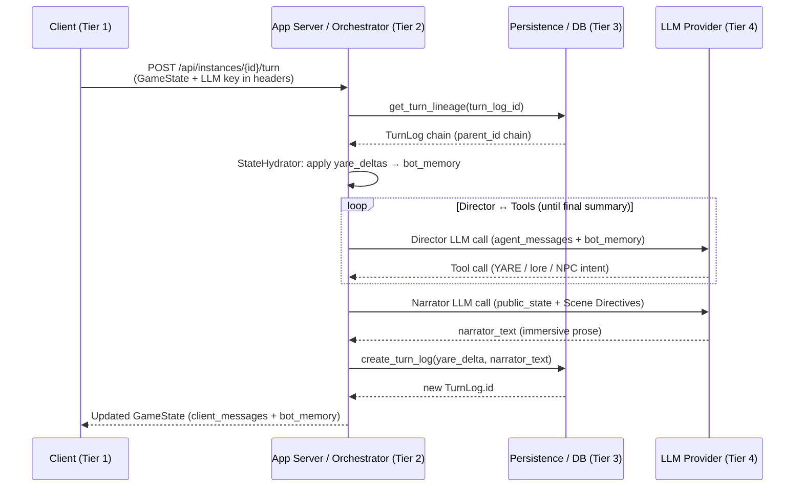

# MnesOS Architectural Design & Interface Contracts

## Executive Summary

This document defines the strategic architecture for MnesOS, a stateless, event-sourced RPG engine. It outlines a modular system that decouples deterministic rules execution (YARE) from high-fidelity narrative orchestration (LangGraph), supporting branching timelines and a scalable four-tier physical deployment model.

**Core Architectural Pillars:**

- **Deterministic Logic**: The YARE Agentic Rules Engine (YARE) provides a safe, bounded environment for mechanics resolution.

- **Agentic Orchestration**: A specialized graph (Director, Narrator, MinigameInput, MinigameOutput) manages intent, minigame interactive components, and prose generation, supported by tool-based NPC intent and RAG lore retrieval.

- **Stateless & Branchable**: A tree-based state model and the Registry Pattern ensure consistent, environment-agnostic execution and timeline manipulation.

- **Interface Driven**: Clear contracts for REST API, storage, and authentication enable cross-platform integration between web clients and backend services.

---

## 0. In-scope Problems MnesOS Aims to Solve

MnesOS targets three primary, product-level problems that undermine RPG play when an LLM is trusted to do both mechanics and story:

### 0.1. Product-level Problems

*   **The Determinism Gap**: LLMs are probabilistic and fundamentally unreliable at math, inventory management, deterministic (such as `if/else`) logic, dice rolls and strict time-tracking.
    *   *Solution*: **YARE (YARE Agentic Rules Engine)**. All state mutation is handled by a deterministic, code-based engine. The LLM only *triggers* the rules; it does not perform the calculations.

*   **Lore Forgetting & Continuity Drift**: LLMs forget, omit or inconsistently apply world lore and prior gameplay context over time. Naively dumping large lore blobs into the prompt increases token cost, adds irrelevant context, and still does not reliably preserve continuity.
    *   *Solution*: **On-Demand RAG Tool (`multi_lore_lookup`)**. Bind a dedicated lore-retrieval tool to the graph so the Director can issue focused, batched lore queries at the moment they are needed. This surfaces concise, relevant snippets from the knowledge base instead of relying on the model to remember everything from prompt history alone.

*   **The Immersion Gap (The "Out-of-Context Numbers")**: When a single LLM resolves mechanics and writes the story simultaneously, it tends to leak raw spreadsheet data into the prose ("You have 14 HP").
    *   *Solution*: **Air-gapped Graph**. The **Director** LLM handles the mechanics and reads the raw "system notes". The **Narrator** LLM is isolated, receiving only the updated `public_state` and scene directives, forcing it to write pure prose. Additional routing nodes (**MinigameInput**, **MinigameOutput**) ensure that structured inputs from interactive components are deterministically processed.

The sections below capture the implementation, design, and operational considerations MnesOS uses to solve these product problems.

### 0.2. Implementation, Design & Operational Considerations

The following design-focused problems explain how the product-level issues are addressed in practice.

*   **The Reliability Gap (Infinite Execution Risks)**: Permitting user-generated game rules (Cartridges) in a Turing-complete language risks catastrophic infinite loops that would hang a game play session.
    *   *Solution*: **Bounded DSL Design**. YARE is intentionally non-Turing complete. It relies on bounded iteration (`foreach`) and strict recursion limits (`max_call_depth`) to guarantee that every turn finishes in a predictable timeframe.

*   **Context Window Inflation**: Automatically including all the  Lore (or keyword-based Lore retrieval and inclusion) or computing NPC logic at the start of every turn (via pre-nodes) wastes tokens and slows down execution for trivial actions (e.g., "I open the door").
    *   *Solution*: **On-Demand Batch Tooling**. The Director actively "asks" for Lore (`multi_lore_lookup`) or NPC reactions (`query_npc_intent`) only when the tactical or emotional complexity of the turn requires it, keeping contexts small and fast.

*   **NPC Meta-Knowledge ("Prompt Bleed")**: If actions/dialogues of NPCs are generated along with the story direction, they often act on "meta" information the player or director knows but the character shouldn't.
    *   *Solution*: **Schema-driven Visibility**. NPCs are not in the main prompt. The Director queries them via the `query_npc_intent` tool, which strictly filters context to only include data tagged with `npc_visibility: true`.

*   **Multi-NPC Rigidity**: Hardcoding a single (or a set number of) graph node(s) for "NPC intent" makes it difficult and expensive to handle scenes with a dynamic number of characters.
    *   *Solution*: **Tool-based Intent Batching**. The Director can pass a dynamic list of relevant characters to a single `query_npc_intent` call.

*   **The Persistence & Branching Problem**: Standard overwriting databases prevent players from exploring alternative timelines (therefore, they resort to "save scumming").
    *   *Solution*: **Stateless Event Sourcing (Tree-based State)**. The backend holds no active state. The game is rebuilt on the fly by applying a chronological chain of `yare_delta` mutations from a specific `TurnLog` ID, natively supporting infinite branching.

*   **The Environment & Security Lock-in Problem**: Storing third-party LLM API keys (OpenRouter) on the backend creates a security liability (a "honey pot"), and tightly coupling the engine makes it hard to run locally.
    *   *Solution*: **Registry Pattern & Side-by-Side Auth**. The client holds its own API keys and passes them "in-flight" per request. The Registry Pattern injects dependencies dynamically, ensuring the exact same code runs locally as a desktop app or in the cloud.

---
## 1. Core Architecture

### 1.1. YARE Interpreter

The YARE Agentic Rules Engine (YARE) is **not strictly Turing Complete** — and this is an intentional design choice. 

- **What it lacks**: It does not support **unbounded** looping (no `while` loops within the DSL) and explicitly limits recursion (nested event calling depth is capped at `max_call_depth = 10`). 

- **What it provides**: It supports bounded iteration via the `foreach` action, robust conditional branching, sequential execution, arbitrary nested state mutation, deterministic RNG (`roll`), and nested state reading.

- **Why it fits**: Evaluating deterministic game logic *must always* halt in a predictable timeframe. Allowing Turing-complete boundless loops inside a configuration file would risk the game entering an infinite loop. By capping recursion and ensuring all iteration is bounded, YARE guarantees safe, total, and deterministic execution.

#### Influence on Narration

YARE solves the **narrative/mechanical decoupling** problem (defined in [Section 0](#0-in-scope-problems-mnesos-aims-to-solve) as "Out-of-Context Numbers") by air-gapping the system output from the narrative output:

- YARE modifies the state backstage and emits structured logging details (e.g., `"Player rolled 12 on lockpicking, Chest unlocked"`).

- These logs are collected as `system_notes`, which are passed along with the full `bot_memory` state to the **Director** node as context, using which the Directory returns final **Scene Directives**.

- The filtered `public_state` and the Director's finalized **Scene Directives** are routed to an independent **Narrator** LLM node, which acts as the "renderer", converting deterministic outcomes into high-quality prose without exposing literal dice rolls or internal system logs.

### Agentic Graph Analysis
The engine leverages a LangGraph state machine structured across two primary LLM decision nodes (`Director`, `Narrator`) and two minor yet important minigame routing nodes (`MinigameInput`, `MinigameOutput`). The third logical role, to have independent NPC tactics, is implemented as the **`query_npc_intent` tool** called by the Director.

The architecture mimics a classic Turn-Based RPG:
1. **MinigameInput Node**: Deterministically handles structured incoming minigame interaction payloads.

2. **Director Node**: The Orchestrator. Maps player intent, resolves mechanics via tools, and queries NPCs.

3. **MinigameOutput Node**: A tool-less router node that sets up scene directives immediately after a minigame is requested.

4. **Narrator Node**: The Storyteller. Renders finalized outcomes into prose.

5. **NPC Intent Tool (`query_npc_intent`)**: The Actor. Provides autonomous character dialogue/intent without the overhead of a separate graph node.

6. **Lore Tool (`multi_lore_lookup`)**: The Librarian. Allows the Director to actively retrieve world lore for multiple queries in a single batch call.

7. **YARE Tools (built by `build_yare_event_tools`)**: The Rules Engine Bridge. Compiles cartridge events into typed, sandboxed LangGraph tools the `Director` can call; tools return deterministic `yare_delta`s, `system_notes`, and execution traces.

The **architecture with specialized tools and routing nodes** provides the optimal balance of isolation and performance, preventing "prompt bleed" and reducing latency compared to assigning a full graph node to NPCs, while ensuring seamless minigame interactivity.

### State and Turn Flow
The agent is **stateless across invocations**. The client owns persistence.
- The client passes the current `GameState` into the graph.
- The agent returns an updated `GameState`, which the client stores.

There are two distinct message concepts:
1. **`client_messages`**: Persistent story history (Client-owned).
2. **`agent_messages`**: Ephemeral per-turn internal protocol messages (LLM prompts/tool traces). Reset at start, cleared at end.

**Dynamic Tool Generation**: Every YARE event defined in the cartridge is converted into a native LangChain tool with its own schema. `parallel_tool_calls=False` ensures the Director handles one mechanic at a time, preventing state conflict. The iterative loop (`Director -> Tools -> Director`) handles complex chain reactions. 

> **Note:** We can actually allow `parallel_tool_calls=True` as long as at most one tool changes the graph's state. This would allow the Director to query npc intent and lore in parallel. 
> 
> This is a future **TO-DO**. 

### NPC Interaction Model
MnesOS uses a **Tool-Based Intent Model** to handle NPCs. 

1. **Director** identifies qualifying NPCs from `bot_memory`.

2. **Director** calls `query_npc_intent(present_npcs=[...], scene_context="...")`.

3. **`query_npc_intent` tool** generates a JSON response containing `dialogue`, `action_intent`, and `internal_monologue`.

4. **Director** receives the intents, resolves mechanics via YARE, and summarizes the results for the Narrator.

To prevent NPCs from being overwhelmed by global state or acting on meta-knowledge, only variables marked with `npc_visibility: true` are passed to the NPC intent tool context. NPCs utilize a mix of **Name Mode** (unique individuals) and **Tag Mode** (archetypes).

> **Note:** NPCs should not share single `npc_visibility`. In the future, we will implement support for who knows which information (a dictionary?)
> 
> This, again, is a future **TO-DO**.

---

## 2. Stateless Architecture & Deployment

The `Orchestrator` is stateless, requiring a "Hydration" phase for each turn where state is reconstructed from a `TurnLog` ID.

### Event Sourcing & Tree-Based State
We employ a **Tree-based Event Source** model, allowing branching timelines.
- **TurnLog (The Node):**
    - `parent_id`: Links back to the previous state, enabling the tree structure.
    - `yare_delta`: The atomic state changes made during this specific turn.
    - `narrator_text`: Explicitly stored to prevent re-running the graph.
- **GameSave (The Bookmark):**
    - A pointer to a specific `TurnLog.id`.

### State Hydration Logic
To reconstruct `bot_memory` at any given node:
1. Traverse up the `parent_id` chain to the root.
2. Reverse the list (Root -> Target Node).
3. Sequentially apply every `yare_delta` and message to a blank state object. 
*(Note: To handle deletions over time, the `_extract_delta` engine produces `None` tombstones when a key is removed, which the hydrator honors by actively popping the key out of the dictionary.)*

> **Note:** A periodic snapshotting of `bot_memory` (to avoid reconstructing everything at turn 1024 from turn 0) is something to consider.
> 
> This is a future **TO-DO**.

### Dynamic State (`GameState`) vs Static State (`RunnableConfig`)

Redundant static data (`yare_config`, `prompt_directives`, `lore_path`, `lore_content`, `persona_context`) are passed via `RunnableConfig`. Only `client_messages` and `bot_memory` are kept in persistent state.

### Four-Tier Physical Deployment Model
| Layer | Component | Physical Location |
| :--- | :--- | :--- |
| **Tier 1: Client** | UI (Web/React/Mobile/Desktop) | User's Device |
| **Tier 2: App Server** | FastAPI / Orchestrator | Localhost (Sidecar) or Cloud VM |
| **Tier 3: Persistence** | SQLite / PostgreSQL | Local Disk or Managed Server DB |
| **Tier 4: Cognitive** | LLM Provider Factory | Remote API (OpenRouter / MnesOS Proxied) or Local LLM |

---

## 3. Interfaces & Contracts

The following sequence diagram shows a single game turn flowing across all four tiers:

### REST API Contracts (Tier 1 <-> Tier 2)
We use a **Side-by-Side Auth** approach. Endpoints require the client to pass their identity credential and their LLM Provider configuration/PKCE token "in-flight" via headers. Keys are never stored server-side.

- **Process Turn**: `POST /api/instances/{instance_id}/turn`
- **Inject State** (Cheating): `POST /api/instances/{instance_id}/inject` (Appends a `SYSTEM` turn)
- **Game Saves**: `POST /api/instances/{instance_id}/saves`
- **Load Game State**: `GET /api/instances/{instance_id}/state?turn_log_id=...`

### Storage & Persistence Contracts (Tier 2 <-> Tier 3)
`AbstractStorageComponent` supports the tree-based Event Source architecture, introducing `get_turn_lineage`, `create_game_save`, and `get_game_saves`.

### Core Engine Orchestration (Tier 2 Internal)
The `StateHydrator` applies the `yare_delta` lineage to rebuild state. The `Orchestrator` is strictly stateless, utilizing the LangGraph app by passing the static config via `RunnableConfig`.

### LangGraph Context & Config (Tier 2 <-> Tier 4)
- **Live State**: Passed via the primary TypedDict state, modified during execution. Contains `client_messages`, `bot_memory`, `agent_messages`, `system_notes`, `bot_memory_staging`, etc.
- **Static Configuration**: Accessed via the secondary `config` parameter (`RunnableConfig`). Contains parsed YAML definitions and LLM client instances.

### The Registry Pattern
To keep the codebase identical across environments (Server vs. Local) and minimize the blast radius, dependencies are resolved *before* LangGraph is invoked via the **Registry Pattern**.

1. **Auth & Identity Abstraction**: `AuthProvider` and `LLMAuthValidator` process requests.
2. **Hierarchical Configuration**: `ConfigMerger` creates a `MnesOSRuntimeConfig` via Request Overrides > Player Settings > Cartridge Defaults.
3. **LLM Provider Factory**: Instantiates specific `BaseChatModel` and `Embeddings` instances depending on the configuration (OpenRouter, MnesOS, Local).
4. **Batch RAG Tooling**: `multi_lore_lookup` is bound as a tool. The Director searches lore efficiently mid-turn rather than relying entirely on pre-node injection.
