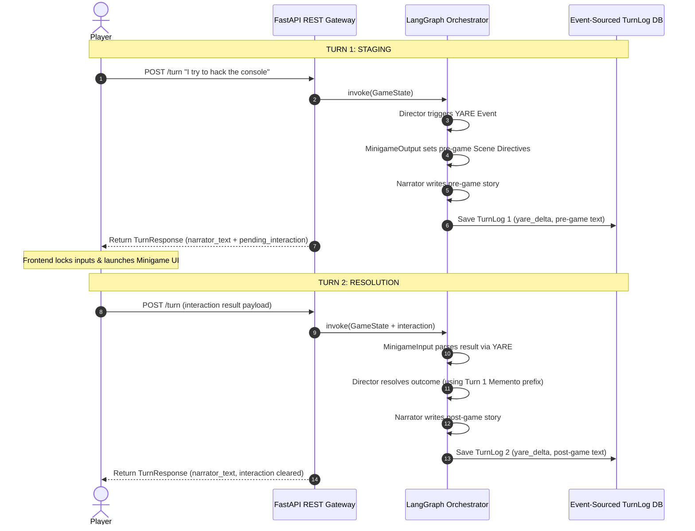

# Mini-game Subsystem Architecture

This document defines the technical architecture of how skill-based mini-games are integrated, staged, and resolved within the MnesOS Agentic Engine.

## 1. Overview
The mini-game subsystem provides a decoupled, asynchronous pathway for resolving mechanical challenges (e.g., lockpicking, hacking, combat) using a split-turn architecture. 

Rather than relying on stateful server checkpoints or complex execution suspends, the engine treats mini-games as boundary transitions between two distinct, stateless API requests:
1. **Turn 1 (Staging Turn):** The game is triggered, pre-game narrative context is delivered to the player, and the client-side UI is launched.
2. **Turn 2 (Resolution Turn):** The client returns the game result, the engine resolves the consequences via YARE, and the narrative continues.

---

## 2. Decoupled Frontend Registry (Single Source of Truth)
To prevent backend bloat, all mini-game code (logic, canvas rendering, assets) is owned strictly by the React frontend (`web-client`). The backend orchestrator remains completely blind to the game mechanics.

### Manifest Discovery
Each frontend mini-game registers a static configuration manifest:
* **Difficulty Schema:** Declares expected configuration arguments (e.g., `{ time_limit: int, grid_size: int }`).
* **Asset Schema:** Declares visual overrides (e.g., custom icons, themes).
* **Output Schema:** Declares the structured metrics returned on completion (e.g., `{ score: int, moves: int }`).

At build time, these manifests compile into a unified `/schemas/minigames.json` schema. The `mnesos-cartridge-development` AI and YARE tools ingest this schema to ensure cartridge developers trigger games with valid parameters.

---

## 3. Split-Turn Lifecycle

The execution flow spans two HTTP requests over the REST API:



---

## 4. State Preservation & Continuity (The Memento Pattern)

To avoid "LLM amnesia" across the turn boundary without introducing a stateful LangGraph checkpointer database, the engine implements a **Memento Pattern** inside the event-sourced `bot_memory`.

### The Context Loss Problem
At the start of every turn, `StateHydrator` resets `agent_messages` (the LLM reasoning history) to keep token counts small. Consequently, when the Director runs in Turn 2 to resolve the outcome, it has lost its Turn 1 planning train of thought and pre-game scene details.

### The Solution: Previous Directive Prefix
1. **Turn 1 (Staging):** After `MinigameOutput` generates the pre-game `Scene Directive` block, the node serializes this block directly into a transient key: `state["bot_memory"]["_previous_scene_directives"]`.
2. **Persistence:** This variable is naturally written to the database `TurnLog` as part of the turn's `yare_delta`.
3. **Turn 2 (Resolution):** When the Director is re-invoked, the engine extracts the `_previous_scene_directives` and prepends them to the Director's system prompt as a structured context block.
4. **Clean-up:** Once the Director completes resolution and the Narrator finishes the turn, a cleanup hook pops `_previous_scene_directives` from `bot_memory`, preventing permanent history pollution.

### Prompt Formulation (Turn 2 Director)
```markdown
--- PRE-GAME STATE DIRECTIVES ---
The minigame was initiated with these directives in the previous turn:
[Contents of _previous_scene_directives]

--- MINIGAME OUTCOME ---
Result: [incoming_interaction.status] (Metrics: [incoming_interaction.metrics])

--- YOUR TASK ---
Write the new resolving Scene Directive for the consequence of this outcome.
Do NOT repeat the pre-game factual outcomes or dialogue.
```

---

## 5. Architectural Benefits

By abandoning the stateful checkpointer in favor of this stateless, memento-driven approach, we achieve:
1. **Perfect Event-Sourced Alignment:** Saves, loads, and time-travel rollbacks remain simple SQL queries against the `TurnLog` table. There are no competing checkpointer databases to synchronize.
2. **High Narrative Continuity:** The Director knows exactly what physical states, dialogue, and environment configurations it established in Turn 1, ensuring zero narrative drift in Turn 2.
3. **Decoupled API Routing:** The API remains a clean gateway that accepts standard requests without having to branch its invocation methods (`Command(resume=...)` vs `.invoke()`).
4. **Simple DX:** The entire complex lifecycle is fully abstracted. Cartridge developers trigger games using simple, linear YAML declarations without worrying about threading or asynchronous execution loops.
