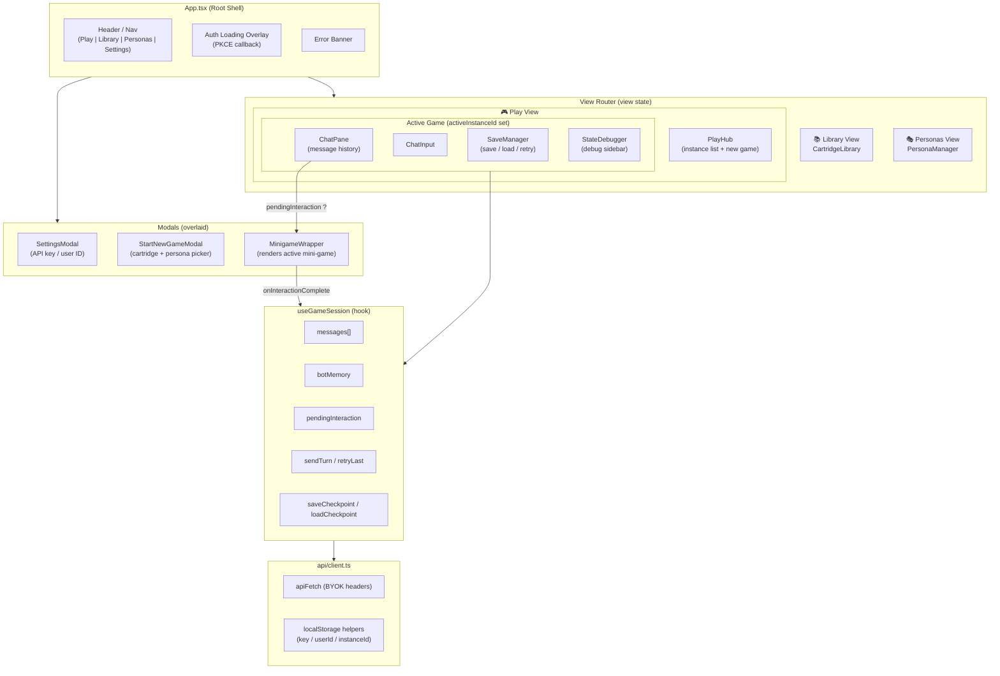
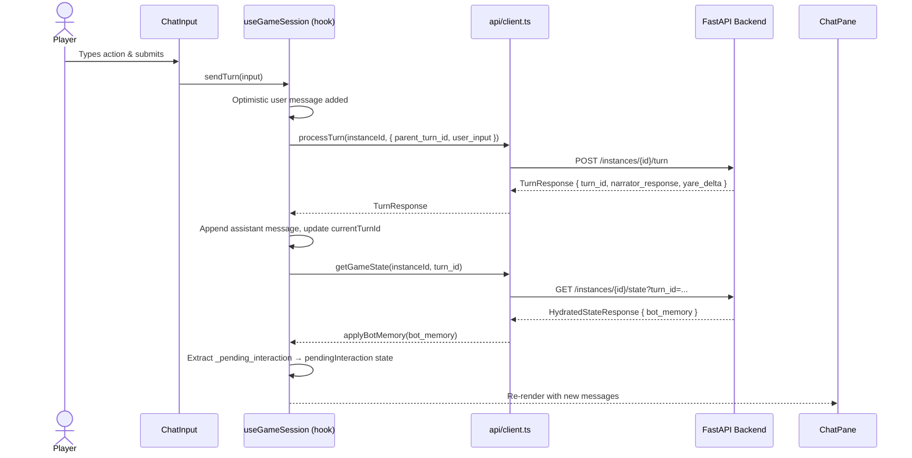
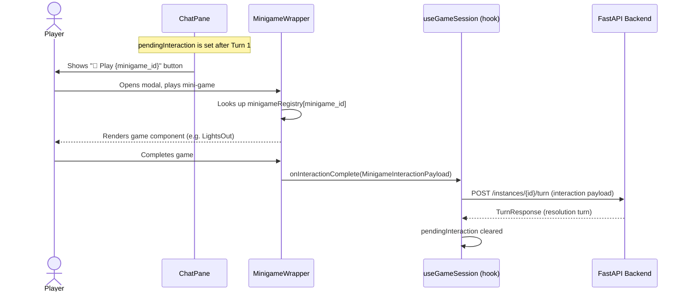

# Web Client Architecture

## Executive Summary

The MnesOS web client is a React + TypeScript single-page application (SPA) served via Vite. It acts as the presentation and interaction layer on top of the stateless FastAPI backend, implementing the **BYOK (Bring Your Own Key)** authentication model and the **split-turn mini-game lifecycle** defined in the backend architecture.

The client is organized into three functional layers: **API** (HTTP transport & credential management), **State** (session and game-loop hooks), and **View** (React components). A dedicated mini-game subsystem provides a frontend-owned **Registry Pattern** that maps game IDs to playable React components, keeping all mini-game code strictly out of the backend.

---

## 1. Directory Structure

```
web-client/src/
├── api/
│   └── client.ts          # HTTP wrapper, localStorage credential helpers
├── components/
│   ├── App.tsx             # Root shell: routing, auth flow, layout
│   ├── CartridgeLibrary.tsx
│   ├── ChatInput.tsx
│   ├── ChatPane.tsx
│   ├── GameInstanceManager.tsx
│   ├── PersonaManager.tsx
│   ├── PlayHub.tsx
│   ├── SaveManager.tsx
│   ├── SettingsModal.tsx
│   ├── StartNewGameModal.tsx
│   ├── StateDebugger.tsx
│   └── minigames/
│       ├── registry.ts        # Mini-game ID → Component map
│       ├── MinigameWrapper.tsx
│       └── LightsOut/
├── hooks/
│   └── useGameSession.ts  # Core gameplay loop state
├── types/
│   ├── index.ts           # API contract types
│   └── minigames.ts       # Mini-game payload types
└── utils/
    └── pkce.ts            # PKCE OAuth helpers
```

---

## 2. Component Diagram



---

## 3. Data Flow: Normal Turn



---

## 4. Data Flow: Mini-Game Turn



---

## 5. Key Patterns & Design Decisions

### 5.1. BYOK Credential Management
Credentials (OpenRouter API key, user ID, active instance ID) are stored in `localStorage` and injected into every request by `apiFetch` in `api/client.ts`. No server-side session is required. This aligns with ADR §1.4 (Registry Pattern & Side-by-Side Auth).

### 5.2. Frontend Mini-Game Registry
`minigames/registry.ts` exports a plain `Record<string, ComponentType>` map. Adding a new mini-game requires only registering a component; no backend or schema changes are needed. This is the frontend implementation of the **Decoupled Frontend Registry** described in `mini-games.md §2`.

### 5.3. Pending Interaction Gate
`useGameSession.applyBotMemory()` extracts `_pending_interaction` from `bot_memory` after every turn and stores it in `pendingInteraction` state. `ChatPane` conditionally renders the "Play mini-game" affordance, and `MinigameWrapper` gates on this state. This mirrors the backend's **Input Router** hard gate.

### 5.4. Optimistic UI
`sendTurn` appends the user's message optimistically before awaiting the API response, providing immediate feedback without a dedicated loading skeleton for outgoing messages.

### 5.5. PKCE OAuth
`App.tsx` handles the OpenRouter PKCE callback on mount: it reads the `?code=` query parameter, exchanges it via `utils/pkce.ts`, and stores the resulting key. The URL is cleaned up without a page reload using `history.replaceState`.

---

## 6. SOLID Principles Assessment

### 6.1. Single Responsibility Principle (SRP)

| Unit | Assessment |
|------|-----------|
| `api/client.ts` | **Good.** Strictly handles HTTP transport and credential I/O. No rendering logic. |
| `useGameSession` | **Mostly Good.** Manages the gameplay loop (messages, turn progression, saves). However, it also parses `_pending_interaction` strings from `bot_memory`, which is a backend-format concern leaking into the session hook. |
| `App.tsx` | ~~**Violation.** `App.tsx` handles PKCE OAuth callback logic, navigation view routing, active instance state, mini-game open/close state, auth loading overlay, and global error banners — all in a single component. This should be split across a router, an auth context, and a layout component.~~ **Fixed (MNS-260521-04).** `App.tsx` is now a thin composition root. PKCE/auth state lives in `AuthProvider` (`contexts/AuthContext.tsx`), instance + minigame state lives in `GameInstanceProvider` (`contexts/GameInstanceContext.tsx`), and all layout + routing lives in `AppShell` (`components/AppShell.tsx`). |
| `CartridgeLibrary.tsx` | **Violation.** Defines both the library list view *and* the `CreateCartridgeModal` sub-component inline in the same file. The modal is non-trivial and belongs in its own file. |

### 6.2. Open/Closed Principle (OCP)

| Unit | Assessment |
|------|-----------|
| `minigameRegistry` | **Good.** New mini-games can be added by registering a component without modifying `MinigameWrapper` or any other consumer. |
| `api/client.ts` | **Partial.** Adding a new API resource requires adding new exported functions but does not force modification of the `apiFetch` core. Acceptable for an internal module. |

### 6.3. Liskov Substitution Principle (LSP)

All mini-game components implement the `MinigameComponentProps` interface defined in `registry.ts`. Any component satisfying this contract can substitute another in the registry without breaking `MinigameWrapper`. **Good.**

### 6.4. Interface Segregation Principle (ISP)

| Unit | Assessment |
|------|-----------|
| `GameSession` interface | ~~**Violation.** `useGameSession` exposes a single fat `GameSession` interface containing messaging, saving, error handling, mini-game interaction, and session reset. Consumers that only need read-only display (e.g., `ChatPane`) are forced to depend on the full surface. Consider splitting into `GameSessionActions` and `GameSessionState`.~~ **Fixed (MNS-260521-07).** `useGameSession` now exports `GameSessionState` and `GameSessionActions`, and display-only components depend on the state-only surface. |
| `SaveManagerProps` | **Good.** Props are narrowly scoped to save/load operations. |
| `ChatPaneProps` | ~~**Mostly Good.** The `pendingInteraction` prop is typed as `any`, which bypasses type safety. Should use the `PendingInteraction` interface from `MinigameWrapper`.~~ **Fixed (MNS-260521-07).** `pendingInteraction` now uses the shared `PendingInteraction` type from `types/minigames.ts`. |

### 6.5. Dependency Inversion Principle (DIP)

| Unit | Assessment |
|------|-----------|
| `useGameSession` → `api/client` | **Violation.** The hook imports concrete functions directly from `api/client.ts`. Testing requires mocking module imports rather than injecting an API abstraction. An `ApiClient` interface would allow swapping in a mock. |
| `PlayHub` → `api/client` | **Same violation.** Direct import of `listInstances`, `deleteInstance`. |
| `MinigameWrapper` → `registry` | **Good.** The registry is injected as a plain data structure, keeping `MinigameWrapper` decoupled from any specific game implementation. |

---

## 7. Anti-Patterns Identified

### 7.1. ~~God Component — `App.tsx`~~ (Fixed in MNS-260521-04)
~~`App.tsx` accumulates too many responsibilities: OAuth callback handling, view routing, active instance lifecycle, mini-game modal state, and auth error display. This makes the root component fragile and difficult to test in isolation.~~

~~**Recommendation:** Extract an `AuthProvider` context for PKCE state, a `<Router>` component for view switching, and a `<GameInstanceProvider>` for active instance tracking.~~

**Resolution:** `App.tsx` is now a thin composition root rendering `<AuthProvider><GameInstanceProvider><AppShell /></GameInstanceProvider></AuthProvider>`. Auth state and PKCE callback logic live in `contexts/AuthContext.tsx` (exposed via `useAuth()`). Active instance and minigame modal state live in `contexts/GameInstanceContext.tsx` (exposed via `useGameInstance()`). All header, navigation, view routing, and layout rendering live in `components/AppShell.tsx`.

### 7.2. ~~Stringly-Typed Interaction Parsing~~ (Fixed in MNS-260521-03)
~~In `useGameSession.applyBotMemory()`, the hook attempts to parse `_pending_interaction` from a JSON string using a fragile regex replacement (`replace(/'/g, '"')`). This couples the client to a backend serialization quirk and will silently fail on edge cases.~~

**Resolution:** `_pending_interaction` is now persisted as a structured object, and the client no longer tries to coerce string payloads (it warns on regressions instead).

### 7.3. ~~`any` Typed Props~~ (Fixed in MNS-260521-07)
~~`ChatPane` uses `pendingInteraction?: any`, discarding type information at the component boundary and propagating unsafety downstream.~~

**Resolution:** `pendingInteraction` is now typed via the shared `PendingInteraction` interface in `types/minigames.ts`.

### 7.4. ~~`window` Custom Events for Navigation~~ (Fixed in MNS-260521-05)
~~`PlayHub` and `StartNewGameModal` trigger navigation by dispatching `CustomEvent("mnesos-play-instance")` on `window`. `App.tsx` listens for this event to change the active view. This is an implicit global bus that bypasses React's component tree and makes the data flow opaque.~~

~~**Recommendation:** Replace with a React context or a proper router (e.g., React Router) that makes navigation state explicit and traceable.~~

**Resolution:** `AppShell` now passes an explicit `onPlayInstance` callback (typed via `PlayInstancePayload`) into `PlayHub`, `GameInstanceManager`, and `StartNewGameModal`, making play navigation state traceable and type-safe without global events.

### 7.5. Inline Modal Co-location
`CartridgeLibrary.tsx` defines `CreateCartridgeModal` in the same file. While convenient for a prototype, this inflates file size and makes the modal untestable in isolation.

**Recommendation:** Extract `CreateCartridgeModal` to `components/CreateCartridgeModal.tsx`.

### 7.6. ~~Side Effects in `useEffect` with Stale Closure Risk~~ (Obsoleted by MNS-260521-05)
~~In `App.tsx`, the `mnesos-play-instance` event listener captures `session` from the enclosing scope. Since `session` is a new object on every render, the dependency array `[session]` causes the listener to be re-registered on every session state change, which can cause missed events during rapid state transitions.~~

~~**Recommendation:** Stabilize the `session.resetSession` reference with `useCallback` in `useGameSession`, or extract only the stable callback reference into the event listener dependency array.~~

**Resolution:** This issue is obsoleted by MNS-260521-05 (the global `window` custom event bus was removed and replaced with explicit callbacks/context). No additional changes are required unless the legacy event bus is reintroduced.
