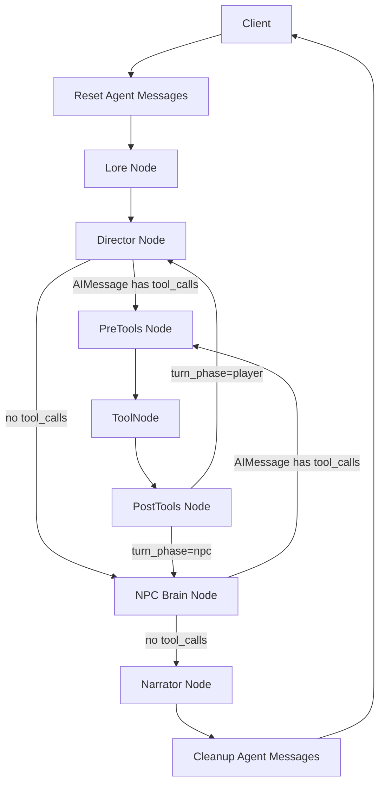

# Architecture

This document describes the current turn architecture implemented in `src/MnesOS/graph.py`.

## Terms

- client: the caller that invokes `app.invoke(...)`
- agent: the compiled LangGraph workflow
- node: one unit of graph execution, LLM-backed or deterministic

## Core Architecture



## State Ownership

The agent is stateless across invocations. The client owns persistence.

- the client passes the current `GameState` into `app.invoke(...)`
- the agent returns an updated `GameState`
- the client stores that returned state and provides it again on the next turn

This split keeps storage, sessions, and user identity outside the graph.

## Message Model

There are two distinct message concepts.

### `client_messages`

Persistent story history. This belongs to the client and is part of `GameState`.

- latest user turn is appended by the client before invoke
- latest narrator reply is appended by the agent before returning state
- this history is available to all LLM nodes for cross-turn continuity

### `agent_messages`

Ephemeral per-turn internal protocol messages, stored in `GameState` with the `add_messages` reducer.

- `director_node` and `npc_brain_node` append their `AIMessage` response (which may carry `tool_calls`)
- `ToolNode` executes `trigger_event` and appends `ToolMessage` results via `Command`
- `reset_agent_messages_node` clears this channel at graph entry
- `cleanup_agent_messages_node` clears this channel before returning to the client

The client never sees or manages `agent_messages`.

## Turn Flow

1. `reset_agent_messages_node` clears any stale `agent_messages` from a previous turn
2. `context_retrieval_node` reads the latest client message and current world state, then retrieves relevant lore
3. `director_node` binds the `trigger_event` tool to the LLM with `parallel_tool_calls=False`, invokes it, and appends the `AIMessage` to `agent_messages`
4. `pre_tools_node` clears `bot_memory_staging` (the YARE write buffer) to ensure a clean slate
5. `ToolNode` calls `trigger_event`; the tool runs `YAREInterpreter` and returns `Command(update={bot_memory_staging, system_notes, agent_messages})` — all three fields have reducers so concurrent writes are safe
6. `post_tools_node` reads the last entry from `bot_memory_staging` and writes it to `bot_memory`, then clears the staging buffer — this is the single authoritative write point for world state
7. `npc_brain_node` does the same as step 3 for NPC decision-making; steps 4–6 repeat for NPC tool calls
8. `narrator_node` receives the full `agent_messages` history and `client_messages` and produces the assistant response
9. `cleanup_agent_messages_node` clears `agent_messages` before returning state to the client

## Tool Protocol

Director and NPC Brain each bind the single `trigger_event` LangChain tool to the LLM with `parallel_tool_calls=False`:

```python
response = llm.bind_tools([trigger_event], parallel_tool_calls=False).invoke(prompt_messages)
```

`parallel_tool_calls=False` constrains the LLM to emit at most one tool call per response. The `Director → PreTools → Tools → PostTools → Director` loop handles multi-event turns iteratively (capped at `MAX_ITERATIONS = 3`).

Routing decisions (`route_director`, `route_npc_brain`) inspect the `tool_calls` attribute on the last `AIMessage` in `agent_messages` — no separate `tool_calls` state field exists.

`ToolNode` dispatches to `trigger_event`, which receives the full `GameState` via `InjectedState`. The tool runs `YAREInterpreter` and returns a `Command` that appends `[interpreter.state]` to `bot_memory_staging`, appends notes to `system_notes`, and pushes a `ToolMessage`. Because all three keys have reducers, concurrent writes can never cause `InvalidUpdateError`. `post_tools_node` then commits `bot_memory_staging[-1]` to `bot_memory` — a single plain-assignment update from a regular node, not a tool.

The LLM supplies `event_name` and `event_args`. Both Director and NPC Brain inject the available event signatures — name plus `inputs` field list — into the system prompt so the LLM knows the expected keys for `event_args`. The YARE engine is the sole executor of game logic.

## Cartridge Inputs

A cartridge contributes:

- `yare.yaml`
- `bot_lore.md`
- optional `prompt_directives.yaml`

The agent does not contain cartridge-specific behavior. Cartridges should express game-specific logic as data.