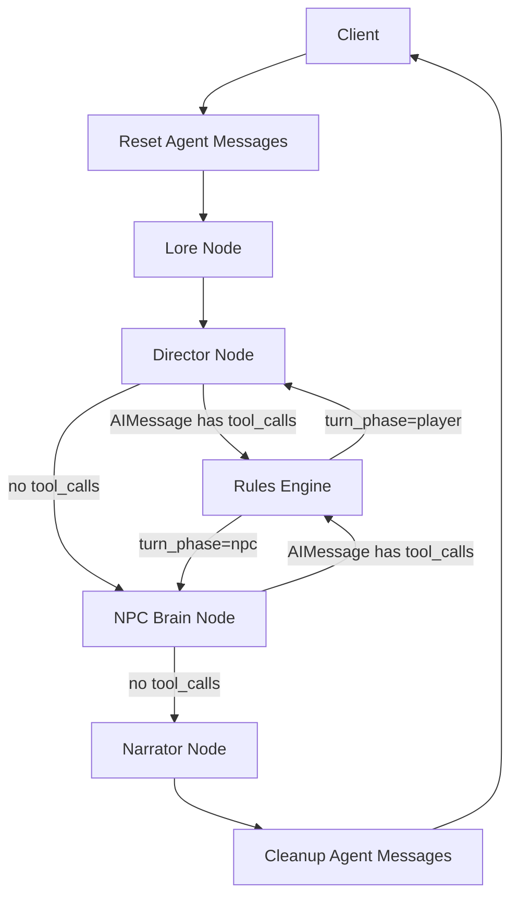

# Architecture

This document describes the current turn architecture implemented in `src/graph.py`.

## Terms

- client: the caller that invokes `app.invoke(...)`
- agent: the compiled LangGraph workflow
- node: one unit of graph execution, LLM-backed or deterministic

## Core Architecture



## State Ownership

The agent is stateless across invocations. The client owns persistence.

- the client passes the current `GameState` into `app.invoke(...)`
- the agent returns an updated `GameState`
- the client stores that returned state and provides it again on the next turn

This split keeps storage, sessions, and user identity outside the graph.

## Message Model

There are two distinct message concepts.

### `client_messages`

Persistent story history. This belongs to the client and is part of `GameState`.

- latest user turn is appended by the client before invoke
- latest narrator reply is appended by the agent before returning state
- this history is available to all LLM nodes for cross-turn continuity

### `agent_messages`

Ephemeral per-turn internal protocol messages, stored in `GameState` with the `add_messages` reducer.

- `director_node` and `npc_brain_node` append their `AIMessage` response (which may carry `tool_calls`)
- `rules_engine_node` appends `ToolMessage` results for each event that fired
- `reset_agent_messages_node` clears this channel at graph entry
- `cleanup_agent_messages_node` clears this channel before returning to the client

The client never sees or manages `agent_messages`.

## Turn Flow

1. `reset_agent_messages_node` clears any stale `agent_messages` from a previous turn
2. `context_retrieval_node` reads the latest client message and current world state, then retrieves relevant lore
3. `director_node` binds the `trigger_event` tool to the LLM, invokes it, and appends the `AIMessage` to `agent_messages`
4. `rules_engine_node` reads `tool_calls` from the last `AIMessage` in `agent_messages`, calls `YAREInterpreter`, and appends `ToolMessage` results back into `agent_messages`
5. `npc_brain_node` does the same as step 3 for NPC decision-making
6. `narrator_node` receives the full `agent_messages` history (AI + Tool responses) and `client_messages` and produces the assistant response
7. `cleanup_agent_messages_node` clears `agent_messages` before returning state to the client

## Tool Protocol

Director and NPC Brain each bind the single `trigger_event` LangChain tool to the LLM:

```python
response = llm.bind_tools([trigger_event]).invoke(prompt_messages)
```

Routing decisions (`route_director`, `route_npc_brain`) inspect the `tool_calls` attribute on the last `AIMessage` in `agent_messages` — no separate `tool_calls` state field exists.

`rules_engine_node` iterates those same tool calls and dispatches each to `YAREInterpreter.run_event()`. The YARE engine is the sole executor; the LLM only names the event and supplies arguments.

## Cartridge Inputs

A cartridge contributes:

- `yare.yaml`
- `bot_lore.md`
- optional `prompt_directives.yaml`

The agent does not contain cartridge-specific behavior. Cartridges should express game-specific logic as data.