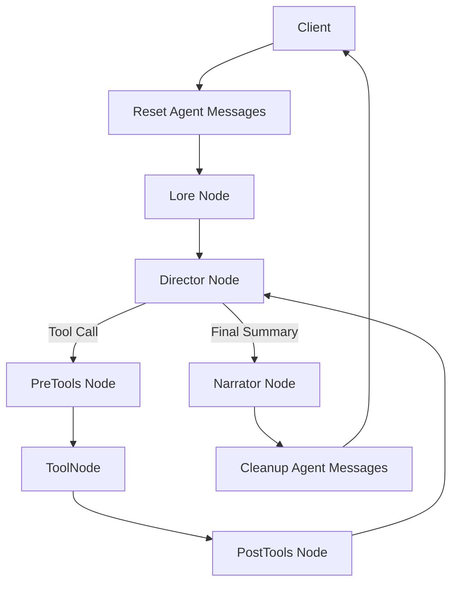

# Architecture: State and Turn Flow

This document describes the internal turn architecture implemented in `src/MnesOS/graph.py`.

## Terms

- client: the caller that invokes `app.invoke(...)`
- agent: the compiled LangGraph application (built via `build_graph()`)
- node: one unit of graph execution, LLM-backed or deterministic

## Core Architecture



## State Ownership

The agent is stateless across invocations. The client owns persistence.

- the client passes the current `GameState` into `app.invoke(...)`
- the agent returns an updated `GameState`
- the client stores that returned state and provides it again on the next turn

This split keeps storage, sessions, and user identity outside the graph.

## Message Model

There are two distinct message concepts.

### `client_messages`

Persistent story history. This belongs to the client and is part of `GameState`.

- latest user turn is appended by the client before invoke
- latest narrator reply is appended by the agent before returning state
- this history is available to all LLM nodes for cross-turn continuity

### `agent_messages`

Ephemeral per-turn internal protocol messages (LLM prompts and tool traces), stored in `GameState` with the `add_messages` reducer.

- `Director` appends its `AIMessage` response (carrying `tool_calls`)
- `ToolNode` executes the requested YARE event or NPC query and appends `ToolMessage` results
- `reset_agent_messages_node` clears this channel at graph entry
- `cleanup_agent_messages_node` clears this channel before returning to the client

The client never sees or manages `agent_messages`.

## Turn Flow

1. **`reset_agent_messages_node`**: Clears any stale `agent_messages` from a previous turn.
2. **`context_retrieval_node`**: Reads the latest client message and current world state, then retrieves relevant lore chunks.
3. **`director_node`**: Binds all dynamic YARE tools and the `query_npc_intent` tool. Invokes the LLM to analyze intent and choose an action.
4. **`pre_tools_node`**: Clears `bot_memory_staging` (the YARE write buffer) to ensure a clean slate for the current iteration.
5. **`ToolNode`**: Executes the tool call. If it's a YARE event, it runs the `YAREInterpreter`. If it's `query_npc_intent`, it queries the NPC brain. Returns a `Command` with updates.
6. **`post_tools_node`**: Commits the updated state to `bot_memory` and clears the staging buffer.
7. **Iteration Loop**: The graph routes back to the `Director` (up to `MAX_ITERATIONS = 3`) to allow for sequential resolutions (e.g., Attack -> NPC React -> Results).
8. **`narrator_node`**: Once the Director provides a final plain-text summary (Scene Directive), the Narrator renders the turn into story prose.
9. **`cleanup_agent_messages_node`**: Clears internal traces.

## Tool Protocol

MnesOS uses **Dynamic Tool Generation**. At graph compilation, every YARE event defined in the cartridge is converted into a native LangChain tool with its own schema.

```python
# graph.py implementation detail
tools = build_yare_event_tools(yare_config)
tools.append(build_npc_intent_tool(llm_npc))

# In director_node
response = llm.bind_tools(tools, parallel_tool_calls=False).invoke(prompt)
```

`parallel_tool_calls=False` ensures the Director handles one mechanic at a time, preventing state conflict. The iterative loop (`Director -> Tools -> Director`) handles complex chain reactions. 

Routing decisions inspect the `tool_calls` attribute on the last `AIMessage` in `agent_messages`. If no calls are present, the turn transitions to the `Narrator`.
