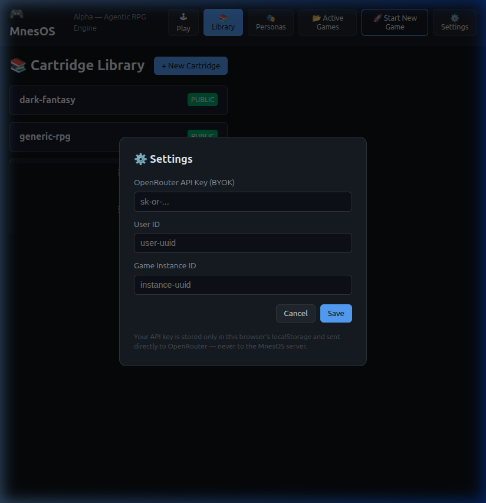
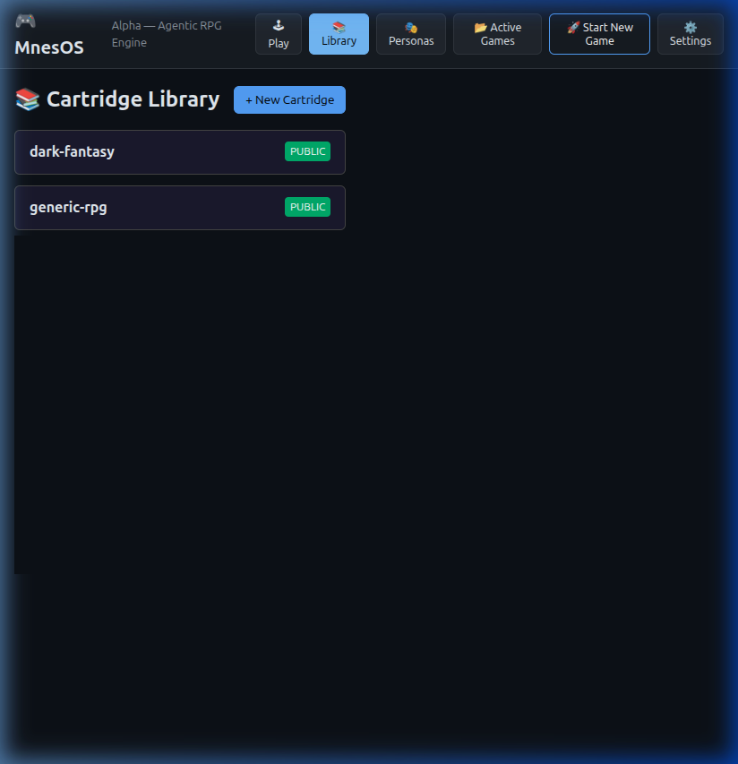
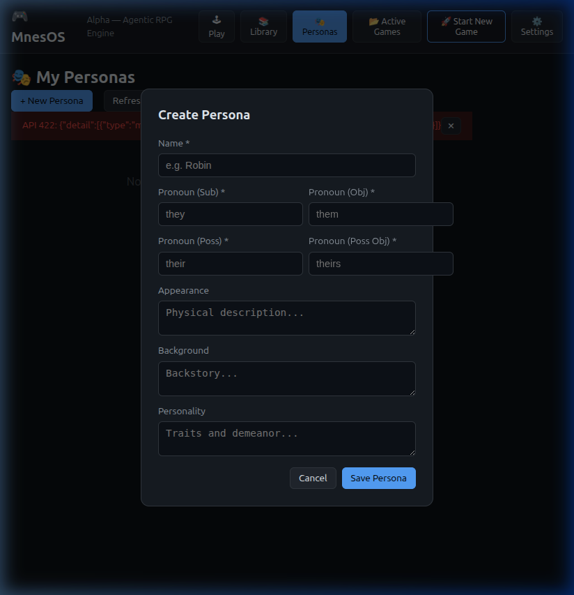
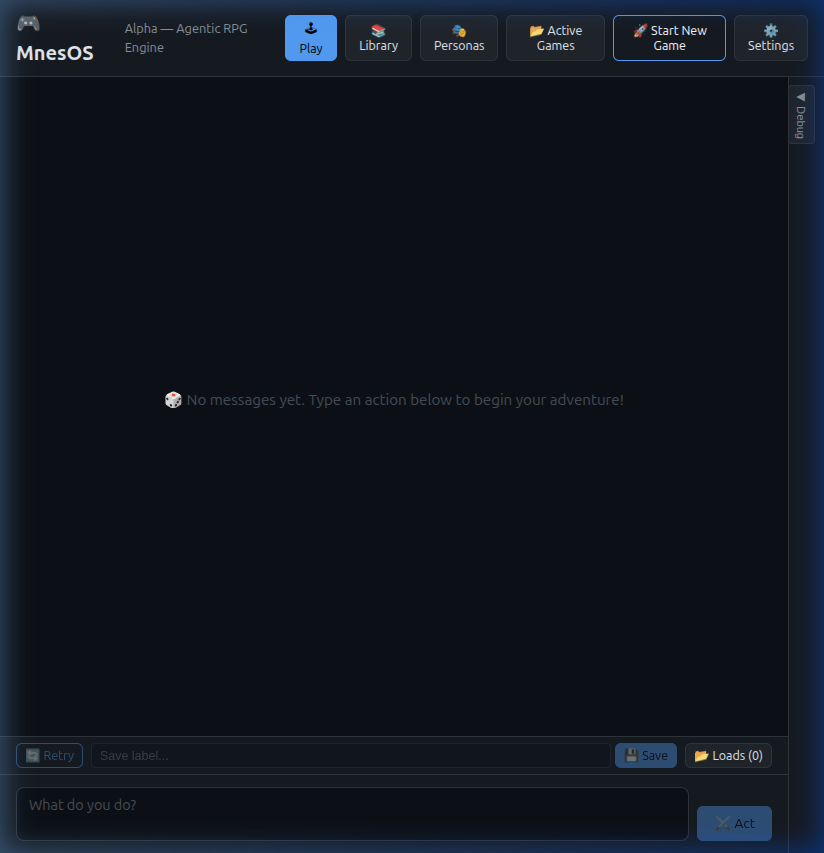
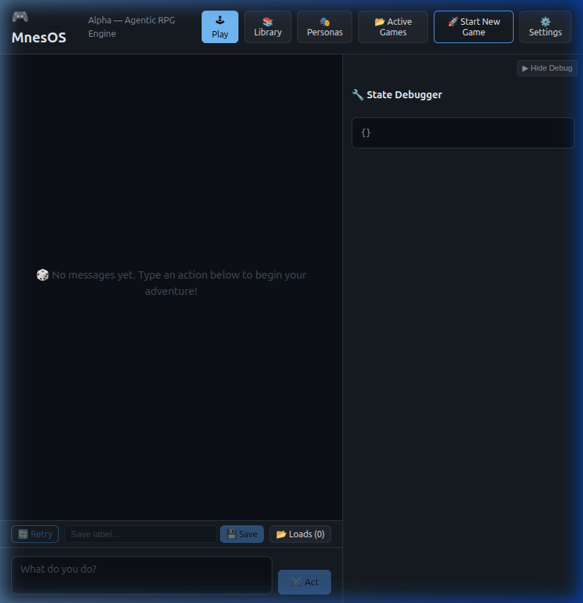

# Play-Testing MnesOS on Windows — Step-by-Step Guide

This guide walks you through setting up and running a local play-test of the MnesOS agentic RPG engine on Windows from scratch. It is written for people who are comfortable using a terminal (PowerShell or Command Prompt), but who are **not** software engineers.

---

## What You Will Be Running

MnesOS has two parts that must run at the same time:

| Part | What it is | Where you run it |
|---|---|---|
| **Backend (API server)** | Python application that runs the game engine | Terminal 1 |
| **Web UI (front-end)** | Browser app you use to actually play | Terminal 2 |

You will need **two terminal windows** (PowerShell is recommended) open side by side.

---

## Prerequisites

### 1. Install Python 3.12+

MnesOS requires Python 3.12 or newer.

**Check your current version first:**
Open PowerShell and type:

```powershell
python --version
```

If the output says `Python 3.12.x` or higher, you are good — skip to step 2.

**If you need to install Python:**
1. Download the installer from [Python.org](https://www.python.org/downloads/windows/).
2. **IMPORTANT:** During installation, make sure to check the box that says **"Add Python to PATH"**.
3. Once installed, close and reopen your terminal and run `python --version` again to verify.

---

### 2. Install Node.js via nvm-windows

The web UI requires Node.js. We recommend using **nvm-windows** (Node Version Manager) to manage your Node versions.

1. Download the latest `nvm-setup.exe` from the [nvm-windows releases page](https://github.com/coreybutler/nvm-windows/releases).
2. Run the installer and follow the prompts.
3. Open a **new** PowerShell window and verify it's installed:

```powershell
nvm version
```

**Install and use the latest LTS version of Node.js:**

```powershell
nvm install lts
nvm use lts
```

**Verify Node and npm are available:**

```powershell
node --version   # e.g. v22.x.x
npm --version    # e.g. 10.x.x
```

---

## Quick Reference

### First-time setup only

```powershell
# In the MnesOS project root:
python -m venv venv
.\venv\Scripts\activate
pip install -e ".[dev,api]"
mnesos-ingest-cartridges

# In web-client\ (one-time install):
npm install
```

### Starting up (every session)

```powershell
# Terminal 1 — Backend API server
cd C:\path\to\MnesOS
.\venv\Scripts\activate
uvicorn MnesOS.api.app:app --reload

# Terminal 2 — Web UI
cd C:\path\to\MnesOS\web-client
npm run dev
```

Then open **http://localhost:5173** in your browser.

---

## Part 1 — Setting Up the Backend (Python / API Server)

Open **Terminal 1** (PowerShell) and navigate to the MnesOS project root:

```powershell
cd C:\path\to\MnesOS
```

> **Tip:** Replace `C:\path\to\MnesOS` with the actual folder path where you downloaded MnesOS.

### Step 1.1 — Create a Virtual Environment

```powershell
python -m venv venv
```

This creates a `venv` folder in your project directory to keep dependencies organized.

### Step 1.2 — Activate the Virtual Environment

On Windows, the activation command is slightly different than on Linux/macOS:

```powershell
.\venv\Scripts\activate
```

Your terminal prompt should now show `(venv)` at the beginning.

> **Note:** If you get an error about "scripts cannot be executed on this system", you may need to run this command once (as Administrator) to allow local scripts: `Set-ExecutionPolicy -ExecutionPolicy RemoteSigned -Scope CurrentUser`.

### Step 1.3 — Install Python Dependencies

```powershell
pip install -e ".[dev,api]"
```

### Step 1.4 — Ingest Game Cartridges

```powershell
mnesos-ingest-cartridges
```

### Step 1.5 — Start the API Server

```powershell
uvicorn MnesOS.api.app:app --reload
```

Leave this terminal running. The API server is now at **http://localhost:8000**.

---

## Part 2 — Setting Up the Web UI (Front-End)

Open **Terminal 2** (PowerShell) and navigate to the web client directory:

```powershell
cd C:\path\to\MnesOS\web-client
```

### Step 2.1 — Install JavaScript Dependencies

```powershell
npm install
```

### Step 2.2 — Start the Web UI Dev Server

```powershell
npm run dev
```

The UI is now running at **http://localhost:5173**. Open this in your browser.

---

## Part 3 — Using the Web UI

The interface on Windows is identical to the Linux/macOS versions.

### Step 3.1 — Configure Settings First

Click **⚙️ Settings** in the header.



| Field | What to enter |
|---|---|
| **OpenRouter API Key (BYOK)** | Your `sk-or-...` key |
| **User ID** | Any string (e.g. `windows-user`) |

Click **Save**.

### Step 3.2 — Browse the Library

Click **📚 Library**.



### Step 3.3 — Create a Persona

Click **🎭 Personas**, then **+ New Persona**.



### Step 3.4 — Start a New Game

Click **🚀 Start New Game**, select your cartridge, version, and persona, then click **Start Game**.

### Step 3.5 — Playing the Game

Interact with the narrator in the **🕹 Play** view.



Expand the **State Debugger** on the right to see live game data:



---

## Part 4 — Stopping the Servers

Press `Ctrl+C` in both terminal windows to stop the servers.

To deactivate the Python virtual environment:
```powershell
deactivate
```

---

## Troubleshooting (Windows Specific)

### Script Execution Error
If you cannot activate the venv, run this in PowerShell:
`Set-ExecutionPolicy -ExecutionPolicy RemoteSigned -Scope CurrentUser`

### Python Not Found
Ensure you checked **"Add Python to PATH"** during installation. If not, reinstall Python or manually add it to your System Environment Variables.

### nvm or node Not Recognized
Ensure you restarted your terminal after installing `nvm-windows`.
