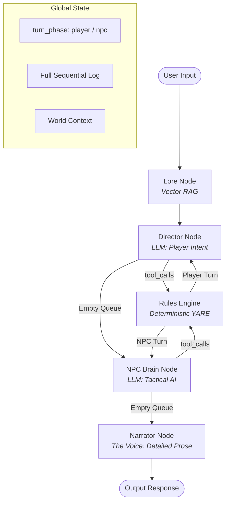

# Final Walkthrough: The Professional Agentic RPG Engine (v2 - Serial NPC Brain)

This architecture separates narrative flair from mechanical determinism while introducing a multi-agent serial tactical loop. This ensures NPCs don't just react flavorfully, but act strategically based on calculated outcomes.

## 1. The Core Architecture

The graph follow a **Serial Multi-Agent ReAct** pattern, with context loaded upfront.



---

## 2. Key Components

### 2.1 The YARE Interpreter ([src/interpreter.py](file:///home/neolaw/projects/janitor-ai-eval/sandbox/src/interpreter.py))
- **Mathematical Integrity**: Uses a whitelisted Python AST evaluator. 
- **Boundary Enforcement**: State mutations (`mutate`) respect `state_schema` (min/max).

### 2.2 NPC Brain Node ([src/prompts.py](file:///home/neolaw/projects/janitor-ai-eval/sandbox/src/prompts.py))
- **Decision Loop**: Unlike the Director (which listens to the user), the NPC Brain listens to the **Rules Engine**. 
- **Strategic Actuator**: It decides if the NPC should counter-attack, flee, or advance the scene based on the player's roll outcomes.

### 2.3 Vector RAG Lore ([src/context.py](file:///home/neolaw/projects/janitor-ai-eval/sandbox/src/context.py))
- **Context injection**: Pulls from `cartridges/<bot>/bot_lore.md` to ground the Narrator.

---

## 3. Cartridge Layout

Cartridges are isolated logic packages located in `/cartridges/`.

```bash
cartridges/
  <bot-name>/
    yare.yaml     # The Rules & DB Schema
    bot_lore.md   # The Creative Context
```

## 4. Execution Logic
1. **Lore Retrieval**: The user's input and current location evaluate the Vector Store. The retrieved context is attached to the state so ALL LLMs in the chain are "Lore-aware".
2. **Director**: The LLM reads the user input (and Lore) and pushes tool calls. Sets `turn_phase="player"`.
3. **Rules Engine (Loop 1)**: Executes tools. Routes back to Director until the queue is empty.
4. **NPC Brain**: The Tactical AI sees the Lore and the mechanical results of the Player's turn. It pushes NPC counter-actions. Sets `turn_phase="npc"`.
5. **Rules Engine (Loop 2)**: Executes tools. Routes back to NPC Brain until the queue is empty.
6. **Narrator**: Describes the total, fully-resolved sequence of events beautifully without needing to hallucinate math.
